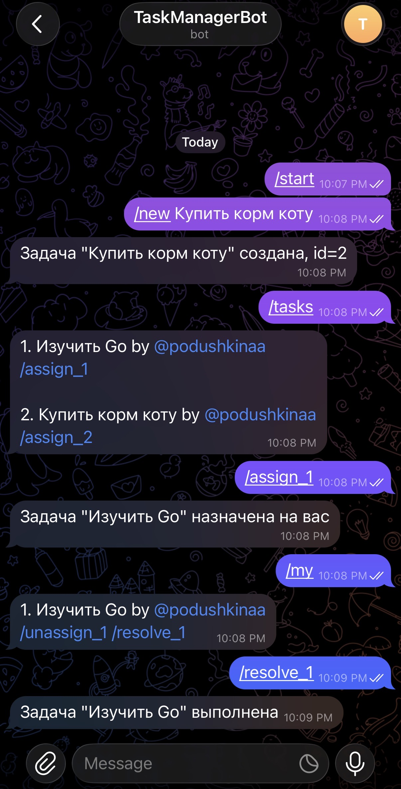
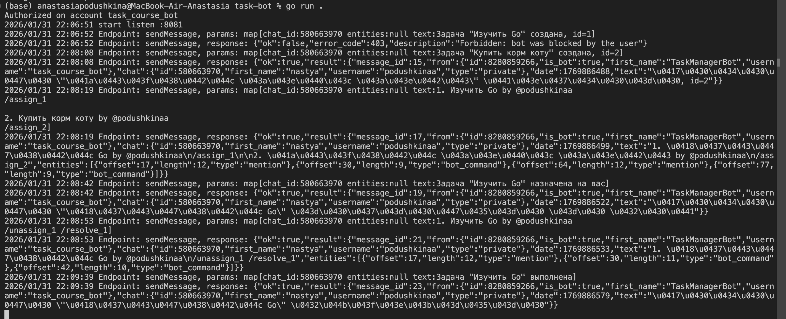

# 🤖 Go Task Manager Bot

Telegram-бот для управления задачами, написанный на Go.
Проект реализует полный цикл работы с задачами: создание, назначение на исполнителя, просмотр и завершение.


---

## 📸 Демонстрация работы

### 1. Интерфейс в Telegram
Взаимодействие с ботом: создание задач, назначение (`/assign`) и выполнение (`/resolve`).

<p align="center">
  
</p>

### 2. Логи сервера
Обработка вебхуков в реальном времени. Сервер парсит JSON от Telegram API и маршрутизирует команды.

<p align="center">
  
</p>

---

## 🏗 Архитектура проекта

Проект построен по принципу **Clean Architecture** (разделение ответственности). Код разбит на слои, чтобы избежать "Spaghetti code".

### 📂 Структура проекта

```text
course-homework/
└── task-bot/
    ├── bot.go        // 🎮 Точка входа (Main): инициализация, вебхуки, роутинг
    ├── storage.go    // 💾 Слой данных: хранение задач в памяти, мьютексы (Thread Safety)
    ├── parse.go      // 🧠 Логика: парсинг текстовых команд (/new, /assign)
    ├── format.go     // 🎨 Представление: красивое форматирование сообщений для Telegram
    ├── go.mod        // 📦 Зависимости проекта
    └── README.md     // 📄 Документация
```

### Компоненты системы:

1.  **`bot.go` (Controller)**
    * Точка входа. Инициализирует сервер и Webhook.
    * Слушает входящие обновления (`Updates`) от Telegram.
    * Маршрутизирует команды (`/new`, `/tasks`) в бизнес-логику.

2.  **`storage.go` (Model / In-Memory DB)**
    * Отвечает за хранение данных (`map[int]*Task`).
    * **Thread Safety:** Реализует `sync.RWMutex` для защиты от состояния гонки (Race Conditions), так как к боту могут обращаться несколько пользователей одновременно.
    * `Lock()` для записи, `RLock()` для чтения.

3.  **`parse.go` (Logic)**
    * Парсер команд. Превращает сырую строку `"/new Купить молоко"` в структурированный объект команды.
    * Изолирует логику обработки текста от логики бота.

4.  **`format.go` (View)**
    * Отвечает за красивое отображение.
    * Формирует итоговый текст сообщения (добавляет смайлики, ID задач, кнопки команд).

---

## 🛠 Технические особенности

* **Concurrency:** Использование `goroutines` для обработки HTTP-запросов.
* **Safety:** Защита от *Deadlock* (взаимной блокировки) путем правильного использования мьютексов (не вызываем методы с `Lock` внутри других методов с `Lock`).
* **Webhooks:** Бот работает через вебхуки (Push-модель), а не через Long Polling. Для локальной разработки использовался туннель (`localhost.run` / `ngrok`).

## 📋 Список команд

* `/tasks` — Показать все задачи.
* `/new <Текст>` — Создать новую задачу.
* `/assign_<ID>` — Взять задачу на себя.
* `/unassign_<ID>` — Снять задачу.
* `/resolve_<ID>` — Отметить выполненной (удалить).
* `/my` — Фильтр: только мои задачи.
* `/owner` — Фильтр: задачи, созданные мной.

---

## 🚀 Как запустить

1.  **Клонировать репозиторий:**
    ```bash
    git clone [https://github.com/podushkina/go-backend-practice.git](https://github.com/podushkina/go-backend-practice.git)
    ```

2.  **Настроить конфиг:**
    В файле `bot.go` указать свой токен и URL вебхука:
    ```go
    BotToken = "YOUR_TOKEN"
    WebhookURL = "YOUR_HTTPS_URL"
    ```

3.  **Запустить:**
    ```bash
    go run .
    ```
